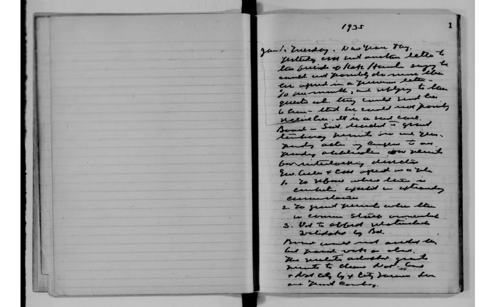

# Unscored 1935 notebook-page comparison

This page was supplied after the Epoch 19 adapter was trained. No verified
official transcript is available in this repository, so the outputs below are
not assigned CER, WER, or model wins. The human-readable heading note is only a
visual diagnostic, not archival ground truth.

All models received the same complete page with deterministic decoding,
`max_pixels=1605632`, `max_new_tokens=1536`, and at most two completeness
retries. All completed on their first attempt with valid closed XML, no detected
token-limit truncation, and no explicit omission placeholder. Visible-text
lengths were 860 characters for upstream CHURRO, 829 for Epoch 3, and 848 for
Epoch 19.



## Header-only visual check

The heading appears to read `1935` and `Jan 1. Tuesday. New Year Day.` Epoch 3
captures that phrase most closely. Epoch 19's `New York` substitution is a
known failure on this page and should not be hidden by the stronger aggregate
100-page score.

## Upstream CHURRO

```text
1935
1
June 1 Tuesday. New York.
Yesterday I sent another letter to
the editor of the St. Louis Star & Sunday News saying he
cannot print an article which appeared in a previous letter -
& so he must reply to the
questioned article. They could send him
to them -- but he would not permit
recirculation. So I sent back
Board -- Sent decided in print
then having permitted one and then
prejudging action by Congress to one
yearly obligation now permits
our interlocking directors
Geo. Cullen & Coe opposed in a vote
1. To reduce where there is
evidence expected or extraordinary
circumstances
2. To grant preferment when there
is common stock concentrated
3. Not to afford retirement
validates by Bill.
Board cannot meet another day
but I have written on about
thirty adjusted grants
prompts to claim that Board
of that city by City Journal has
one Grant Comboy.
```

## Epoch 3

```text
1935
1
Jan 1 Tuesday New Year Day.
Yesterday I sent another letter to
the friends of Kate Hennel saying he
cannot meet me as he cannot
be expected in a few more days
so we must wait and reply to the
guests who, they would send here
to them - that he could not provide
recollections, so he said no.
Board - Sub. decided in grant
tenancy permits one and eleven
payday action in census to one
yearly obligations now permits
one interlocking distributor
Geo. Cullen & Coes opened up a sale
1. To refuse where there is
circumstances except in extraordinary
exemptions
2. To grant permits when there
is common stock ownership
3. Not to afford retirement
validates by Bill.
Brass comes out another line
but general vote on absent.
The resolution adjusted grants
permits to claim not found
that city by city farmers have
our Grant Combs.
```

## Epoch 19

```text
1935
Jan 1 Tuesday New York
Yesterday I sent another letter to
the friends of State Street saying he
cannot and probably does not even
like appear in a previous letter
to me months, and refusing to have
guests etc. they could send him
6 trains - that he could not permit
recitation, it is a sad case.
Board - Sub. decided in grant
terminating permits for one year
pending action by Congress to one
yearly obligations now pending
but interlocking districts
Gov. Cullen & City agreed on a rule
1. To refuse where there is
cumulative effect in extraordinary
circumstances
2. To grant permits when there
is common stock accumulation
3. Not to afford substantial
validates by Bill.
Boards cannot meet another day
and cannot vote on election.
The resolution adjusted grants
permits to Chicago Post Board
& that city by City Journal has
one Grant Company.
```

## Interpretation

This example demonstrates both sides of the adapter:

- Epoch 19 is not guaranteed to beat an earlier checkpoint on every word;
  here, Epoch 3 is clearly better on the heading.
- Valid XML and the absence of an omission marker do not establish text
  accuracy or visual coverage.
- The protected 100-page aggregate comparison supports Epoch 19's overall
  benefit, while this page documents a real phrase-level regression.
- Because no official transcript is present, apparent body-text improvements
  or regressions remain hypotheses requiring human transcription.
